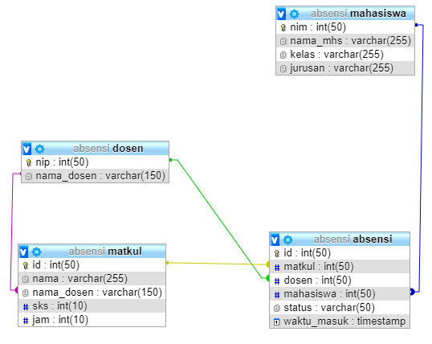

# Breakdown

## List pengerjaan aplikasi

Dalam aplikasi ini terdapat 4 buah obyek yang akan dibuat yakni Mahasiswa, Dosen, Mata Kuliah dan Absensi. Absensi sendiri mendapatkan data dari 3 obyek lainnya. Dengan gambaran relasi dalam database berikut:

Jadi dalam aplkasi ini nanti akan dibahas 4 hal tersebut Dosen, Matkul, Mahasiswa, Absensi.

