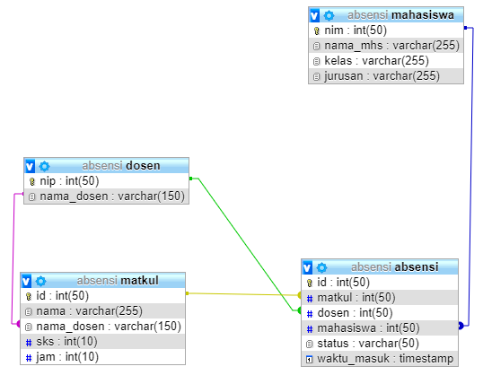

# Tugas: Login, Register, Status

## Studi Kasus

Fungsi ini akan mengatur user yang akan login / register, dengan menggunakan multi user \(Admin\). Dengan gambaran jika user sudah register maka dalam table 'user' akan diset nonaktif, ketika itu admin dapat mengkontrol bila user bisa aktif / tidak.

## Tabel User

## Controller

Controller yang ditambahkan:

* Login &gt; Untuk mengatur proses login dan logout
* Register &gt; Untuk mengatur proses register
* Admin &gt; Untuk mengelola akun user

